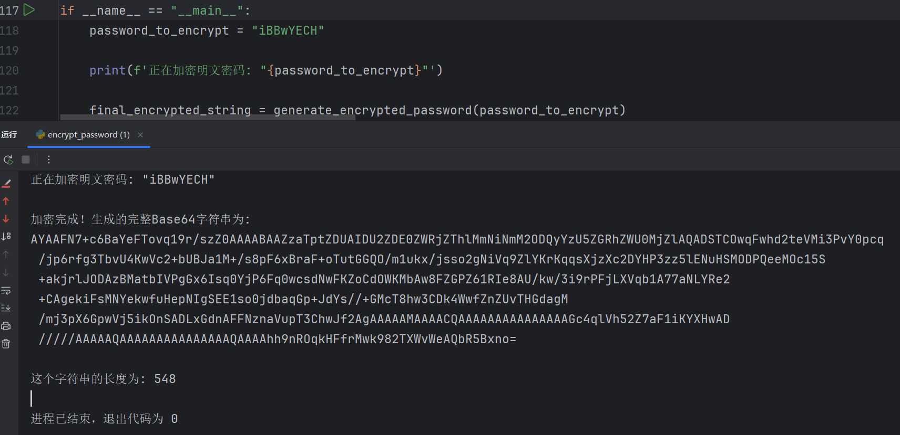

# amazom_encryptedPwd
亚马逊encryptedPwd纯算法, metadata1也有

amazom encrypt "encryptedPwd" only use Python, also have metadata1

SiegeCrypto.addDataType({
	"dataTypeId": "AuthPortalSigninPasswordNA",
	"jwkPublicKey": {"kty":"RSA","e":"AQAB","n":"gXXZV1VqZ6k_uQtyJNJy5q-qvKdqrXJNgKUO1aYc1UPBVqlhCP0GPxf-0GSo-LEtArgcbF8-j6_vSLSqztYxxF8og--rB8zAyZ8DXZaugX-UiJDQnoJL_HtXKuwIm9U7oEPoeD6H4ZDcfbsPj77xVn7UA2-a90N4aZqMC8EIfXIy1tqSbSPnxPOaiEmy8xGtG-L3RdCyc7TL0Swd_f0_DjRT6ip91IBlCmquoa-xJgZ9e44PVH4AwdyssiV4ZLEZ5yFcE0zcRb_62kx_TQptidbJ4nHocFVjmUW9YsrAWeKrBmOGZEjO4vbATYs1Yf4vgcH7Ix61EPR5sbDP4SlBWQ"},
	"providerId": "si:md5",
	"keyId": "56d14edce8e2cb6c6842c59ddaee426e"
});
